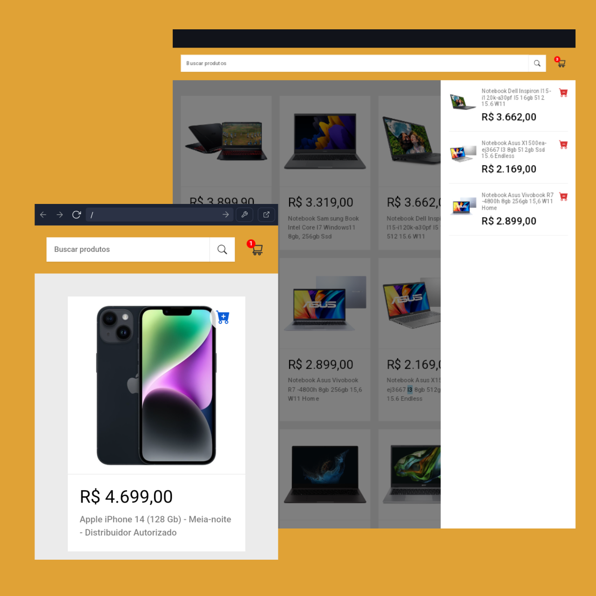

</img>


# Shopping Cart

<a href="https://shopping-cart-eight-topaz.vercel.app/">Shoppin-cart</a>

O projeto do carrinho de compras front-end utiliza React e TypeScript para criar uma interface de usuário interativa. Ele permite aos usuários adicionar produtos ao carrinho, ajustar quantidades e visualizar o total da compra. 

O projeto utiliza a API do MercadoLivre:
```
https://api.mercadolibre.com/sites/MLB/search?q=${query}
```

## Funcionalidades

- Listagem de itens: o App exibi uma lista dos produtos.
- Busca de itens: permite a busca de produtos com base em uma palavra chave.
- Adicionar itens ao carrinho: ao adicionar produtos ao carrinho, é possível ver a somatória total de valor dos itens.
- Remover itens do carrinho.


## Licença

[ISC](https://choosealicense.com/licenses/isc/)


## Referência

 - [Shopping-Cart por manualdodev](https://github.com/manualdodev/shopping-cart)

